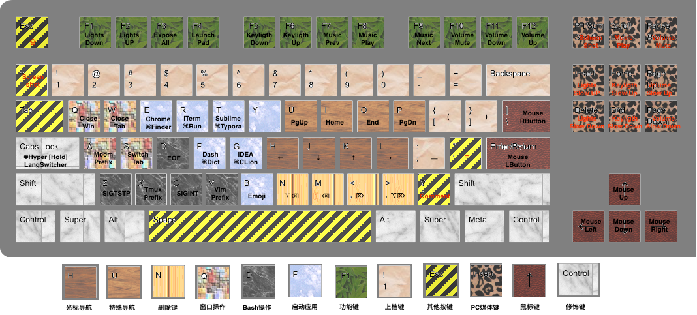

# Capslock

*Make CapsLock Great Again!*  


**Transform Capslock into hyper  key,  and improve your APM tremendously !!!**

* 功能强大：基于CapsLock的新功能键 Hyper(✱)可以与任何按键组合，提供强大的定制性。
* 精心设计：在作者两年使用实践中不断雕琢，将最常使用的操作预置于核心键区，显著提高操作效率。
* 轻量跨平台：分别基于[Karabiner()](https://pqrs.org/osx/karabiner/) 与[AutoHotKey(⊞)](http://www.ahkscript.org/)以脚本方式实现。
* 部署方便：放在随身装机U盘中，还是托管在Github上，简单几步即可复刻环境。


[CapsLock()](osx/)

[CapsLock(⊞)](win/)

## 前言

⇪CapsLock，即大写锁定键，其起源可追溯至打字机时代。打字机是纯机械的设备，当按下Shift时，整套设备会与墨条纸带发生位移，使小写字母“上档”为大写字母。此等操作对小拇指是不小的负担，以致连续输入两到三个大写字母都比较吃力。于是在今天键盘上⇪Capslock的位置上出现了其原型Shiftlock功能键：可以在大小写状态之间切换与保持。这样的设计解决了一指禅选手的困境，更减轻了打字员的负担。

然而随着科技的进步，这样的问题已经不存在了。除了一指禅选手，Shift能够毫不费力的满足人们的需求。而⇪Capslock这个'多余'的按键，则因为历史惯性保留在了绝大多数键盘的黄金位置。

历史上有很多人注意到了这一点，不少人都琢磨着让这个占据宝地的按键发挥出更大的作用。一些键盘直接去掉了⇪Capslock键，而另一些则直接把它作为⌃Ctrl使用。在一些Unix Like（e.g ）环境中，⇪Capslock还被用作语言切换的按键。有些人将⇪Capslock改为复合功能键：单独键入时是⎋ESC，而按住不放时是⌃Ctrl。

不过为什么要浪费这样一个绝佳的机会呢？我们所能做的远比这更多：

譬如创造一个类似⇧ Shift、⌃ Ctrl、⌥ Option、⊞ Win、⎇ Alt 、 ⌘ Command等修饰键的全新功能键：

​										✱ Hyper

## 符号参考表

#### Modifiers: Mac

| Sym  | Key     |
| ---- | ------- |
| ✱    | Hyper   |
| ⌃    | Control |
| ⌥    | Option  |
| ⇧    | Shift   |
| ⌘    | Command |

#### Modifiers: ⊞Windows

| Sym  | Key     |
| ---- | ------- |
| ✱    | Hyper   |
| ⌃    | Control |
| ⊞    | Windows |
| ⇧    | Shift   |
| ⎇    | Alter   |

#### Normal Keys

| GLYPH   | NAME                                   |
| ------- | -------------------------------------- |
|        | Apple                                  |
| ⌘       | Command, Cmd, Clover, (formerly) Apple |
| ⌃       | Control, Ctl, Ctrl                     |
| ⌥       | Option, Opt, (Windows) Alt             |
| ⎇       | Alt                                    |
| ⇧       | Shift                                  |
| ⇪       | Caps lock                              |
| ⏏       | Eject                                  |
| ↩, ↵, ⏎ | Return, Carriage Return                |
| ⌤       | Enter                                  |
| ⌫       | Delete, Backspace                      |
| ⌦       | Forward Delete                         |
| ⎋       | Escape, Esc                            |
| →       | Right arrow                            |
| ←       | Left arrow                             |
| ↑       | Up arrow                               |
| ↓       | Down arrow                             |
| ⇞       | Page Up, PgUp                          |
| ⇟       | Page Down, PgDn                        |
| ↖       | Home                                   |
| ↘       | End                                    |
| ⌧       | Clear                                  |
| ⇥       | Tab, Tab Right, Horizontal Tab         |
| ⇤       | Shift Tab, Tab Left, Back-tab          |
| ␢       | Space, Blank                           |
| ␣       | Space, Blank                           |
| ❘⃝      | Power                                  |
| ⇭       | Num lock                               |
| ?⃝      | Help                                   |
|        | Context menu                           |


## 功能说明

以Mac版本为例：



### 右手核心区

* 基本映射
  * 按住⇪CapsLock，映射为✱ Hyper
  * 按下⇪CapsLock，映射为⌥␢ 输入法切换（二选一，默认）
  * 按下⇪CapsLock，映射为⎋  ESC （二选一）
* 导航键映射
  * 按下✱ Hyper启用光标移动，按下✱⌘时启用光标选择
  * `✱H ↦ ←` (VI导航键：✱H映射为左)
  * `✱J ↦ ↓`  (VI导航键：✱J映射为左)
  * `✱K ↦ ↑`  (VI导航键：✱K映射为左)
  * `✱L ↦ →`  (VI导航键：✱L映射为右)
  * `✱U ↦ ⇞`  (✱U映射为PageUp)
  * `✱I ↦ ↖` (✱I映射为Home)
  * `✱O ↦ ↘` (✱O映射为End)
  * `✱P ↦ ⇟`  (✱P映射为Pagedown)
  * 删除键
  * `✱N ↦ ⌥⌫` (删除光标左侧一个单词)
  * `✱M ↦ ⌫`     (删除光标左侧一个字符)
  * `✱, ↦ ⌦`     (删除光标右侧一个字符)
  * `✱. ↦ ⌥⌦` (删除光标右侧一个单词) 

### 左手核心区
* 窗口操作
  * `✱⇥  ↦ ⌃⇥`         (✱Tab 映射为正向切换标签页)
  * `✱⌘⇥↦ ⌃⇧⇥`      (✱⌘Tab 映射为反向切换标签页)
  * `✱Q  ↦ ⌘Q`            (关闭窗口)
  * `✱W  ↦ ⌘W`            (关闭标签页)
  * `✱A  ↦ ⌃⌥⇧⌘A` (Moom-Meta键，※一个[窗口操作软件](https://manytricks.com/moom/))
  * `✱⌘A ↦ F11`         (回到桌面)
  * `✱S  ↦ ⌃⇥`           (切换标签页)
  * `✱⌘S ↦ ⌃⇧⇥`     (反向切换标签页 )
* Bash控制
  * `✱Z ↦ ⌃Z` (作业停止信号：SIGTSTP))
  * `✱X ↦ ⌃B` (Tmux-Prefix，※一个[终端复用软件](http://tmux.github.io/))
  * `✱C ↦ ⌃C` (作业中断信号：SIGINT)
  * `✱V ↦ , `  (Vim-Leader键)
  * `✱D ↦ ⌃D` (发送EOF)
* 应用快捷方式
  * `✱E  ↦ Google Chrome`
  * `✱⌘E ↦ Finder`
  * `✱R  ↦ iTerm`
  * `✱⌘R ↦ ^R (IDE-Run)`
  * `✱T  ↦ Sublime Text`
  * `✱⌘T ↦ Typora`
  * `✱F  ↦ Dash`
  * `✱⌘F ↦ Dictionary`
  * `✱G  ↦ IntelliJ IDEA`
  * `✱G  ↦ CLion`

### 键盘第一行：功能键
* 功能键映射
  * `✱F1  ↦  BrightnessDown`
  * `✱F2  ↦  BrightnessUp`
  * `✱F3  ↦  ExposeAll`
  * `✱F4  ↦  LaunchPad`
  * `✱F5  ↦  KeyboardLightDown`
  * `✱F6  ↦  KeyboardLightUp`
  * `✱F7  ↦  MusicPrev`
  * `✱F8  ↦  MusicPlay`
  * `✱F9  ↦  MusicNext`
  * `✱F10 ↦  Mute`
  * `✱F11 ↦  VolumeDown`
  * `✱F12 ↦  VolumeUp`

### 键盘第二行：数字键
* 上档键映射
  * `✱[12...-=] ↦ ⇧[12...-=]` (将✱数字键、✱减号、✱等于号上档为对应符号)
  * `✱[] ↦ ⇧90 '()'`  (将✱方括号映射为圆括号)
  * `✱'  ↦ ⇧-  '_' `  (将✱单引号映射为下划线)

### 主键区其他按键
* 主键区其他杂项
  * `✱⎋  ↦ ⇪`       (✱Escape 将✱Hyper转义回⇪CapsLock)
  * `✱␢   ↦ ⎋`      (✱空格 映射为⎋ESC)
  * `✱\  ↦ ⌃/`       (✱斜杠 映射为注释/解注释)
  * `✱`    ↦ ⌃⇧⌘4`(✱反引号 映射为选取截图区域并存储)
  * `✱⌘` ↦ ⌃⇧4`  (✱⌘反引号 映射为选取截图区域至剪贴板)
  * `✱'  ↦ =`           (✱单引号 映射为等于号)

### 特殊键区
* PC键盘特殊按键映射
  * `✱Ins ↦ ⇧⌥F1`  (✱Insert 微调提升屏幕亮度)
  * `✱Del ↦ ⇧⌥F2`  (✱Delete 微调降低屏幕亮度)
  * `✱↘   ↦ ⇧⌥F5` (✱Home 微调提升键盘背光亮度)
  * `✱↖   ↦ ⇧⌥F6` (✱End 微调降低键盘背光亮度)
  * `✱⇟   ↦ ⇧⌥F11` (✱PgUp 微调提升音量)
  * `✱⇞   ↦ ⇧⌥F12` (✱PgDn 微调降低音量)
  * `PrintScreen  ↦ ⌃⇧⌘3` (保存全屏截图至剪贴板)
  * `✱PrintScreen  ↦ ⌃⇧⌘3` (保存全屏截图至桌面文件)
  * `ScrollLock  ↦ VolumeMute` (ScrollLock静音)
  * `Pause       ↦ MusicPlay` (Pause映射为音乐播放)

* 光标键映射
* 
  * `✱↑ ↦ MouseUp`
  * `✱↓ ↦ MouseDown`
  * `✱← ↦ MouseLeft`
  * `✱→ ↦ MouseRight`
  * `✱↩ ↦ MouseLButton`
  * `✱\ ↦ MouseRButton`

## 设计原理

1. `CapsLock`单独按下与长按的区分

   传统上扩展`Capslock`，要么是将其语言切换，要么是将其作为`Control`。但其实这两个功能并不矛盾，一个是单按触发，一个是按下时触发，所以完全可以合并在一起。

   单独按下Capslock时，会触发**语言切换**功能，按住不放时，则激活一个新的功能键`Hyper`，替代传统的`Ctrl`实现更多更丰富的定制功能。当然，另一种做法是将单独按下改造为`ESC`，这就要视需求选择了。

2. 导航键

   导航键包括：`↑`,`↓`，`←`，`→`,`Home`,`End`,`PgUp`,`PgDn`，提供了一套通用的光标移动操作。不过这些键都远离核心键区，导致移动光标需要把右手移开，这一点煞是恼人。最好是将这些导航键映射到右手的核心键区，通过按下`Capslock`键启用，同时需要在移动光标的同时，对文本选取的功能（`Shift`）提供良好支持。

   按下Capslock时，传统的VIM导航键`h,j,k,l`映射为方向键，而将这四个键上方的`u,i,o,p`分别映射为`PageUp`,`Home`, `End`,`PageDown `，提供全局的导航操作。另一方面，因为按下左手需要按下`Capslock`，右手需要控制导航键，都不适合按下两侧的`Shift`键进入文本选择模式，这时候比较好的选择是由左手大拇指同时按下⌘(Mac)或Alt(Win)，将组合键映射为导航键+`Shift`提供文本选取支持。

   这样，vim的导航不仅可以在vim的所有模式中使用，也可以在系统中全局使用了。

3. 删除键

   删除是极其频繁的功能，包括前删（BackSpace）与后删（Delete）。不过Mac和Windows的操作不太一致有些恼人，而且这两个键也都是远离核心键区操作不便。

   将`Capslock`+`nm,.`映射到不同的删除功能上，首先这四个键在`h`,`j`,`k`,`l`正下方，操作非常方便。`Hyper + m`映射为前删`Delete`(Mac)或退格`BackSpace`(Win)，`Hyper+ ,`设计为后删`ForwardDelete`(Mac)或`Delete`(Windows)。同时`n`和`.`则映射为相应的按下`Option`(Mac)或`Ctrl`(Win)的版本，即前删后删一个单词，类似vim的`dw`与`db`，提高长句删除效率。

   这样一来，Mac与Windows的删除行为终于保持一致了，而且删除功能由右手最为灵活的食指和中指负责操作，能大大提高编辑效率。

4. 上档键

   上档是CapsLock的传统功能。但通常Capslock对第二排数字键不起作用，这里不妨反其道行之，将Capslock+数字键映射为对应的上档符号，当然也可以考虑映射为其他的一些命令，例如IDE调试命令，配置切换命令等。同时，一些编程中的高频符号，比如括号，下划线，等于号，也可以从右上角拉下来，放到核心键区。

   比如`CapsLock+; : _` ，`Capslock + ' : =`，`Capslock + [ : (`，`Capslock + ] : )`。这样一来，高频符号下划线和等号就可以方便的录入了，而圆括号映射到方括号这里，让小中大括号一家终于团聚在一起，也减少了输入圆括号的手指位移。

5. 窗口控制

   除了切换应用程序窗口`⌘Tab`(Mac), `Alt+Tab`（Win）外，还有许多经常用到的窗口操作：譬如关闭窗口（关闭应用程序），关闭标签页，切换标签页等。

   CapsLock+Q是Quit，关闭窗口的意思，映射到`⌘Q`(Mac)或`Alt+F4`（Win）。

   CapsLock+W是关闭当前标签，映射到`⌘W`(Mac)或`Ctr+W`(Win)

   CapsLock+S是Switch的意思，切换当前标签页，映射到`^Tab`(Mac & Win)。

   CapsLock+A是两个挨着的键，一起按就是另一个窗口管理软件的Moom的meta-key。可以方便的缩放摆弄窗口，很好用。

   这几个快捷方式非常常用，在IDE或者浏览器里都很方便。

6. Bash控制

   在Bash中，我们习惯Capslock作为Ctrl使用。但是最常用的，必不可少的其实只有几个：

   CapsLock+Z映射到`^Z`，用于发送SIGTSTP挂起作业。

   CapsLock+X映射到`^B`，是终端复用软件Tmux的metakey。

   CapsLock+C映射到`^C`，用于发送SIGINT中断作业。

   CapsLock+V映射到`,`，是Vim的`<Leader> key`

   CapsLock+D映射到`^D`，用于发送`EOF`

   当然，在Windows下面，这些键可以作为传统的编辑键：撤销，剪切，拷贝，粘贴……

7. 媒体控制：

   在没有`Fn`的外接键盘上如何使用Mac的传统功能键？用`Hyper+FX`解忧愁。Capslock+F1就是调低亮度，依此类推。

8. 应用快捷键：

   应用快捷键应当可以用一只手就轻松按出，这也限制了应用快捷键所能使用的键区。基本上适合作为应用快捷键的按键就是左手食指覆盖的键区了。

   这里`ERTYFGB`作为应用快捷键，加上⌘总共可以设置14个高频应用程序的快捷方式。这里是我的设置：

   `Hyper-E： Google Chrome.app`，`Hyper-⌘E: Finder`，E取自Explore的涵义。

   `Hyper-R: iTerm`，`Hyper-⌘R: Ctrl+R (Run)`，R取自Run。

   `Hyper-T： Sublime Text.app`，`Hyper-⌘T: Typora`，T取自Text，放置了常用的文本编辑器。

   `Hyper-F： Dash.app`，`Dictionary`，F取自Find的涵义。最常用的查询软件。

   `Hyper-G： IntelliJ IDEA.app`，`Hyper-⌘G: Clion`，G就是`Great`的意思，所以放了IDE

   `Hyper-B`可以放一些别的东西，目前当做了呼叫Emoji窗口的快捷键(`^⇧Space`)。


## FAQ

* Q： Why using ✱ as symbol of hyper key？

  A：Cause asterisk have the ascii code 42, which is the answer to life, the universe, and everything!  while itself has meaning 'star'. ✱ (Heavy-Asterisk) is a pretty version of `*`(Asterisk). Actually I would choose ☯  if Github could render it properly...

* Q：Why Linux support is missing？

  A：Cause I always use Linux through Terminal of Mac or Windows, so….

* Q：Po主单身吗？

  A：单身！


## 关于

作者：Vonng(fengruohang@outlook.com)

协议：WTFPL


```
do What The Fuck you want to Public License

Version 1.0, March 2000
Copyright (C) 2000 Banlu Kemiyatorn (]d).
136 Nives 7 Jangwattana 14 Laksi Bangkok
Everyone is permitted to copy and distribute verbatim copies
of this license document, but changing it is not allowed.

Ok, the purpose of this license is simple
and you just

DO WHAT THE FUCK YOU WANT TO.
```


